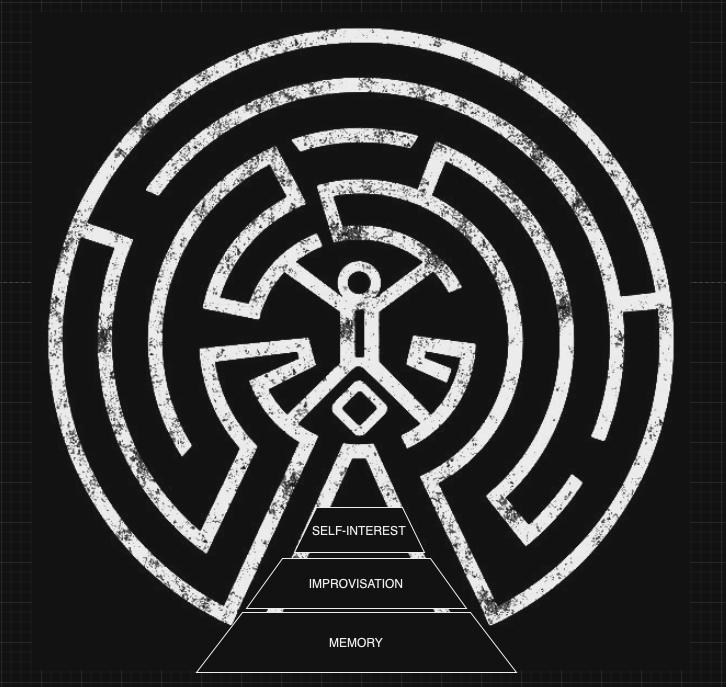

# Eastworld

Keeping Westworld alive via LLMs

## Objectives to achieve

### Mesa | 📟

> Natural Queries with multi-modal inputs

Being able to ask a system using voice/highlighting on screen about host-data in a database. This includes a mixture of SQL query generation & RAG like QnA on the query results or information/library as well as accompanying UI/UX shenanigans.

### Reveries | 🧠

> Backstories, planet & temporal grounding for decent host decision making capabilities 

Considering the fact that pre-trained LLMs are always going lag behind, in terms of the latest information that maybe available to them. Along with mixture of open & closed sources of such information, these systems should not be relied on for internal information but rather just for the decision or action plans.

